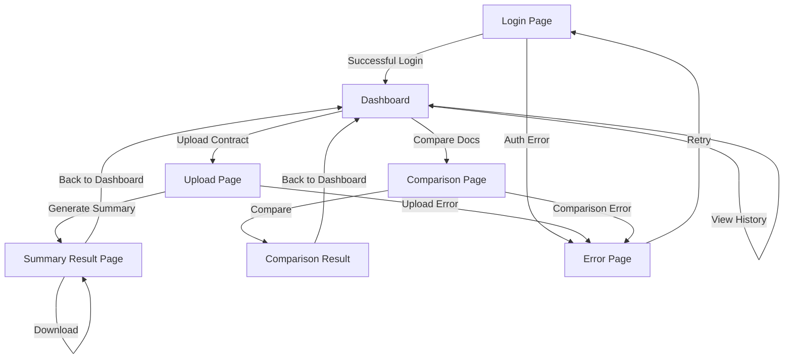

# Design Document: Legal Document Summarization Frontend

## Overview

This design specifies a professional, modern web-based frontend for a legal document summarization SaaS application. The system provides lawyers with an intuitive interface to upload contracts, view AI-generated summaries, assess risks, and compare document versions. The frontend is built using vanilla HTML, CSS, and JavaScript with simulated backend responses for development and testing purposes.

The application follows a multi-page architecture with client-side routing, responsive design principles, and a corporate blue/white color scheme. All backend interactions are simulated using static JSON files to enable frontend development independent of backend services.

## Architecture

### System Architecture

The frontend follows a traditional multi-page application (MPA) architecture with client-side enhancements:

```
┌─────────────────────────────────────────────────────────┐
│                    Browser (Client)                      │
│                                                          │
│  ┌────────────────────────────────────────────────────┐ │
│  │              HTML Pages                             │ │
│  │  • login.html                                       │ │
│  │  • dashboard.html                                   │ │
│  │  • upload.html                                      │ │
│  │  • summary.html                                     │ │
│  │  • comparison.html                                  │ │
│  │  • error.html                                       │ │
│  └────────────────────────────────────────────────────┘ │
│                         │                                │
│  ┌────────────────────────────────────────────────────┐ │
│  │              CSS Stylesheets                        │ │
│  │  • styles/main.css (global)                        │ │
│  │  • styles/login.css                                │ │
│  │  • styles/dashboard.css                            │ │
│  │  • styles/upload.css                               │ │
│  │  • styles/summary.css                              │ │
│  │  • styles/comparison.css                           │ │
│  └────────────────────────────────────────────────────┘ │
│                         │                                │
│  ┌────────────────────────────────────────────────────┐ │
│  │           JavaScript Modules                        │ │
│  │  • js/auth.js (authentication logic)               │ │
│  │  • js/upload.js (file upload handling)             │ │
│  │  • js/api.js (dummy API simulation)                │ │
│  │  • js/utils.js (shared utilities)                  │ │
│  │  • js/dashboard.js (dashboard logic)               │ │
│  │  • js/summary.js (summary display)                 │ │
│  │  • js/comparison.js (comparison logic)             │ │
│  └────────────────────────────────────────────────────┘ │
│                         │                                │
│  ┌────────────────────────────────────────────────────┐ │
│  │              Dummy Data (JSON)                      │ │
│  │  • data/upload-response.json                       │ │
│  │  • data/summary-response.json                      │ │
│  │  • data/comparison-response.json                   │ │
│  │  • data/risk-flags.json                            │ │
│  └────────────────────────────────────────────────────┘ │
└─────────────────────────────────────────────────────────┘
```

### Navigation Flow



## Components and Interfaces

### 1. Authentication Component

**Purpose:** Handles user login and session management

**HTML Structure:**
```html
<div class="login-container">
  <div class="login-card">
    <h1>Legal Document Summarization</h1>
    <form id="login-form">
      <input type="email" id="email" placeholder="Email" required>
      <input type="password" id="password" placeholder="Password" required>
      <button type="submit">Login</button>
      <div id="error-message" class="error hidden"></div>
    </form>
  </div>
</div>
```

**JavaScript Interface:**
```javascript
// auth.js
function validateCredentials(email, password)
  // Returns: { valid: boolean, message: string }
  
function handleLogin(event)
  // Validates form, stores session, redirects to dashboard
  
function checkSession()
  // Returns: boolean (true if logged in)
  
function logout()
  // Clears session, redirects to login
```

**Session Storage:**
- Store user email in `localStorage` as `userEmail`
- Store login timestamp as `loginTime`
- Check session on protected pages

### 2. Dashboard Component

**Purpose:** Main landing page with navigation and statistics

**HTML Structure:**
```html
<div class="dashboard-container">
  <aside class="sidebar">
    <div class="logo">LegalDoc AI</div>
    <nav>
      <a href="dashboard.html" class="active">Dashboard</a>
      <a href="upload.html">Upload Contract</a>
      <a href="comparison.html">Compare Documents</a>
      <a href="#" onclick="logout()">Logout</a>
    </nav>
  </aside>
  
  <main class="main-content">
    <h1>Welcome, <span id="user-name"></span></h1>
    
    <div class="stats-grid">
      <div class="stat-card">
        <h3>Total Documents</h3>
        <p class="stat-number" id="total-docs">0</p>
      </div>
      <div class="stat-card">
        <h3>Processed</h3>
        <p class="stat-number" id="processed-docs">0</p>
      </div>
      <div class="stat-card">
        <h3>Flagged Risks</h3>
        <p class="stat-number" id="flagged-risks">0</p>
      </div>
    </div>
  </main>
</div>
```

**JavaScript Interface:**
```javascript
// dashboard.js
function loadDashboardStats()
  // Loads dummy statistics from localStorage or defaults
  
function updateStatsDisplay(stats)
  // Updates stat card numbers with animation
  
function initializeDashboard()
  // Sets up dashboard on page load
```

### 3. Upload Component

**Purpose:** Drag-and-drop file upload with validation

**HTML Structure:**
```html
<div class="upload-container">
  <div class="upload-area" id="upload-area">
    <div class="upload-icon">📄</div>
    <p>Drag and drop your contract here</p>
    <p class="upload-hint">or click to browse</p>
    <input type="file" id="file-input" accept=".pdf,.docx" hidden>
  </div>
  
  <div id="file-info" class="file-info hidden">
    <p>Selected: <span id="file-name"></span></p>
    <button id="generate-btn" class="primary-btn">Generate Summary</button>
  </div>
  
  <div id="loading" class="loading hidden">
    <div class="spinner"></div>
    <p>Processing your document...</p>
  </div>
  
  <div id="upload-error" class="error hidden"></div>
</div>
```

**JavaScript Interface:**
```javascript
// upload.js
function handleDragOver(event)
  // Prevents default and adds visual feedback
  
function handleDragLeave(event)
  // Removes visual feedback
  
function handleDrop(event)
  // Validates file type and size, displays file info
  
function validateFile(file)
  // Returns: { valid: boolean, error: string }
  // Checks: file type (.pdf, .docx), size (< 10MB)
  
function handleGenerateSummary()
  // Shows loading, simulates API call, redirects to summary page
  
function simulateUpload(file)
  // Returns: Promise<uploadResponse>
  // Simulates 2-3 second delay, returns dummy data
```

**File Validation Rules:**
- Accepted formats: PDF (.pdf), Word (.docx)
- Maximum file size: 10MB
- Display clear error messages for invalid files

### 4. Summary Display Component

**Purpose:** Shows extracted clauses, summary, and risk flags

**HTML Structure:**
```html
<div class="summary-container">
  <header class="summary-header">
    <h1>Document Summary</h1>
    <button id="download-btn" class="primary-btn">Download Summary</button>
  </header>
  
  <section class="summary-section">
    <h2>Executive Summary</h2>
    <div id="summary-text" class="summary-text"></div>
  </section>
  
  <section class="clauses-section">
    <h2>Extracted Clauses</h2>
    <div id="clauses-grid" class="clauses-grid">
      <!-- Clause cards inserted here -->
    </div>
  </section>
  
  <section class="risks-section">
    <h2>Risk Flags</h2>
    <div id="risks-list" class="risks-list">
      <!-- Risk items inserted here -->
    </div>
  </section>
</div>
```

**Clause Card Template:**
```html
<div class="clause-card">
  <h3 class="clause-title">{clauseTitle}</h3>
  <p class="clause-text">{clauseText}</p>
  <span class="clause-tag">{clauseType}</span>
</div>
```

**Risk Flag Template:**
```html
<div class="risk-item risk-{severity}">
  <span class="risk-icon">⚠️</span>
  <div class="risk-content">
    <h4>{riskTitle}</h4>
    <p>{riskDescription}</p>
  </div>
</div>
```

**JavaScript Interface:**
```javascript
// summary.js
function loadSummaryData()
  // Retrieves summary data from sessionStorage or dummy JSON
  
function renderSummary(data)
  // Populates summary text section
  
function renderClauses(clauses)
  // Creates and inserts clause cards
  
function renderRiskFlags(risks)
  // Creates and inserts risk items with appropriate severity styling
  
function handleDownload()
  // Generates downloadable text/PDF file with summary content
  
function createClauseCard(clause)
  // Returns: HTMLElement
  // Creates a single clause card element
  
function createRiskItem(risk)
  // Returns: HTMLElement
  // Creates a single risk flag element with severity class
```

### 5. Comparison Component

**Purpose:** Upload and compare two document versions

**HTML Structure:**
```html
<div class="comparison-container">
  <h1>Compare Documents</h1>
  
  <div class="upload-grid">
    <div class="upload-box" id="upload-box-1">
      <p>Upload Original Version</p>
      <input type="file" id="file-1" accept=".pdf,.docx">
      <div class="file-status" id="status-1"></div>
    </div>
    
    <div class="upload-box" id="upload-box-2">
      <p>Upload Revised Version</p>
      <input type="file" id="file-2" accept=".pdf,.docx">
      <div class="file-status" id="status-2"></div>
    </div>
  </div>
  
  <button id="compare-btn" class="primary-btn" disabled>Compare Documents</button>
  
  <div id="comparison-loading" class="loading hidden">
    <div class="spinner"></div>
    <p>Comparing documents...</p>
  </div>
  
  <div id="comparison-results" class="comparison-results hidden">
    <h2>Comparison Results</h2>
    <table class="comparison-table">
      <thead>
        <tr>
          <th>Clause</th>
          <th>Original</th>
          <th>Revised</th>
          <th>Risk Level</th>
        </tr>
      </thead>
      <tbody id="comparison-tbody">
        <!-- Comparison rows inserted here -->
      </tbody>
    </table>
  </div>
</div>
```

**JavaScript Interface:**
```javascript
// comparison.js
function handleFileSelect(fileNumber, file)
  // Stores file reference, updates UI, enables compare button if both files selected
  
function handleCompare()
  // Shows loading, simulates comparison API call, displays results
  
function simulateComparison(file1, file2)
  // Returns: Promise<comparisonResponse>
  // Simulates 3-4 second delay, returns dummy comparison data
  
function renderComparisonResults(data)
  // Populates comparison table with clause differences
  
function createComparisonRow(clauseData)
  // Returns: HTMLTableRowElement
  // Creates table row with conflict highlighting
```

### 6. Error Handling Component

**Purpose:** Display user-friendly error messages

**HTML Structure:**
```html
<div class="error-page">
  <div class="error-content">
    <div class="error-icon">⚠️</div>
    <h1>Oops! Something went wrong</h1>
    <p id="error-message">We encountered an unexpected error.</p>
    <p class="error-hint" id="error-hint">Please try again or contact support if the problem persists.</p>
    <button onclick="goBack()" class="primary-btn">Go Back</button>
    <a href="dashboard.html" class="secondary-btn">Return to Dashboard</a>
  </div>
</div>
```

**JavaScript Interface:**
```javascript
// utils.js
function showError(message, hint)
  // Displays inline error message with optional hint
  
function hideError(elementId)
  // Hides error message element
  
function redirectToErrorPage(errorType, message)
  // Stores error info in sessionStorage and redirects to error.html
  
function handleNetworkError(error)
  // Standardized network error handling
```

## Data Models

### User Session Model

```javascript
{
  userEmail: string,        // User's email address
  loginTime: number,        // Timestamp of login
  isAuthenticated: boolean  // Authentication status
}
```

### Document Upload Response Model

```javascript
{
  success: boolean,
  documentId: string,       // Unique identifier for uploaded document
  fileName: string,         // Original file name
  fileSize: number,         // File size in bytes
  uploadTime: string,       // ISO timestamp
  status: string            // "uploaded" | "processing" | "completed"
}
```

### Summary Response Model

```javascript
{
  documentId: string,
  summary: string,          // One-page executive summary text
  clauses: [
    {
      id: string,
      title: string,        // e.g., "Payment Terms"
      text: string,         // Full clause text
      type: string,         // e.g., "Financial", "Liability", "Termination"
      page: number          // Page number in original document
    }
  ],
  riskFlags: [
    {
      id: string,
      title: string,        // e.g., "Unlimited Liability"
      description: string,  // Explanation of the risk
      severity: string,     // "high" | "medium" | "low"
      clauseId: string,     // Reference to related clause
      recommendation: string // Suggested action
    }
  ],
  metadata: {
    processedAt: string,    // ISO timestamp
    documentType: string,   // e.g., "Service Agreement"
    pageCount: number
  }
}
```

### Comparison Response Model

```javascript
{
  comparisonId: string,
  document1: {
    id: string,
    name: string
  },
  document2: {
    id: string,
    name: string
  },
  differences: [
    {
      clauseTitle: string,
      original: string,     // Text from document 1
      revised: string,      // Text from document 2
      changeType: string,   // "modified" | "added" | "removed"
      riskLevel: string,    // "high" | "medium" | "low" | "none"
      isConflict: boolean   // True if change creates conflict
    }
  ],
  summary: {
    totalChanges: number,
    highRiskChanges: number,
    conflicts: number
  }
}
```

### Dashboard Statistics Model

```javascript
{
  totalDocuments: number,
  processedDocuments: number,
  flaggedRisks: number,
  lastUpdated: string       // ISO timestamp
}
```

## Correctness Properties

*A property is a characteristic or behavior that should hold true across all valid executions of a system—essentially, a formal statement about what the system should do. Properties serve as the bridge between human-readable specifications and machine-verifiable correctness guarantees.*


### Property 1: Form Validation Rejects Empty Inputs

*For any* form with required fields, when a user submits the form with one or more empty fields, the system should display inline error messages next to the invalid fields and prevent form submission.

**Validates: Requirements 1.2, 6.3**

### Property 2: Navigation Responds to Valid Triggers

*For any* valid navigation trigger (successful login, menu item click, or completed processing operation), the system should navigate to the corresponding target page.

**Validates: Requirements 1.3, 2.3, 3.6**

### Property 3: File Type Validation Accepts Valid Formats

*For any* file with extension .pdf or .docx, when dropped on the upload area, the system should accept the file and display its name.

**Validates: Requirements 3.3**

### Property 4: File Type Validation Rejects Invalid Formats

*For any* file with an extension other than .pdf or .docx, when dropped on the upload area, the system should reject the file and display an error message.

**Validates: Requirements 3.4**

### Property 5: Drag Feedback Appears on Hover

*For any* file dragged over the upload area, the system should provide visual feedback (such as border highlighting or background color change) while the file is over the drop zone.

**Validates: Requirements 3.2**

### Property 6: Clauses Render as Individual Cards

*For any* summary response containing a list of clauses, the system should render each clause as a separate card element in the clauses grid.

**Validates: Requirements 4.1**

### Property 7: Severity Levels Map to Correct Colors

*For any* risk flag or conflict with a severity level, the system should apply the correct color highlighting: red for "high" severity, yellow for "medium" severity, and appropriate styling for "low" severity.

**Validates: Requirements 4.3, 5.5**

### Property 8: Download Triggers File Export

*For any* summary result page with content, when the download button is clicked, the system should trigger a file download containing the summary content.

**Validates: Requirements 4.5**

### Property 9: Compare Button Enables When Both Files Present

*For any* comparison page state, the "Compare Documents" button should be enabled if and only if both file upload slots have valid files selected.

**Validates: Requirements 5.2**

### Property 10: Comparison Results Render as Table

*For any* comparison response containing clause differences, the system should render the differences as rows in a comparison table with columns for clause name, original text, revised text, and risk level.

**Validates: Requirements 5.4**

### Property 11: Risk Levels Display for All Clause Pairs

*For any* clause pair in the comparison results, the system should display the associated risk level in the table row.

**Validates: Requirements 5.6**

### Property 12: Errors Display with Actionable Guidance

*For any* error condition (network error, upload failure, or validation failure), the system should display an error message that includes actionable guidance for resolution.

**Validates: Requirements 6.1, 6.2, 6.5**

### Property 13: Layout Adapts to Viewport Changes

*For any* viewport width change within the supported range (768px to 2560px), the system should adapt the layout to maintain usability, including adjusting the sidebar navigation for tablet sizes.

**Validates: Requirements 7.1, 7.4**

### Property 14: Loading Indicators Appear During Operations

*For any* asynchronous operation (file upload, summary generation, or document comparison), the system should display an animated loading indicator while the operation is in progress.

**Validates: Requirements 8.3**

### Property 15: Dummy Data Contains Required Fields

*For any* risk flag object in the dummy data files, the object should contain all required fields including id, title, description, severity, clauseId, and recommendation.

**Validates: Requirements 10.5**

## Error Handling

### Error Categories

**1. Authentication Errors**
- Invalid credentials (empty fields, wrong format)
- Session expiration
- Unauthorized access to protected pages

**Handling Strategy:**
- Display inline error messages on login form
- Redirect to login page for session/auth failures
- Store intended destination for post-login redirect

**2. File Upload Errors**
- Invalid file type
- File size exceeds limit (>10MB)
- File read errors

**Handling Strategy:**
- Display error message near upload component
- Clear file selection
- Provide specific guidance (e.g., "Please upload a PDF or DOCX file under 10MB")

**3. Network/API Errors**
- Simulated API timeout
- Failed to load dummy data
- JSON parse errors

**Handling Strategy:**
- Redirect to error page for critical failures
- Display inline error for non-critical failures
- Provide retry mechanism

**4. Validation Errors**
- Empty required fields
- Invalid email format
- Missing file selection

**Handling Strategy:**
- Display inline error messages next to invalid fields
- Prevent form submission
- Highlight invalid fields with red border

### Error Message Guidelines

**Tone:** Professional, helpful, non-technical
**Structure:** 
1. What went wrong (brief)
2. Why it happened (if helpful)
3. What to do next (actionable)

**Examples:**
- ❌ "Error 400: Bad Request"
- ✅ "Please enter both email and password to continue"

- ❌ "File type not supported"
- ✅ "Please upload a PDF or Word document (.pdf or .docx)"

- ❌ "Network error"
- ✅ "We couldn't connect to the server. Please check your internet connection and try again."

### Error Recovery

**Session Recovery:**
- Store form data in sessionStorage before navigation
- Restore form data after error recovery
- Clear sensitive data (passwords) after use

**File Upload Recovery:**
- Allow user to retry upload without re-selecting file
- Preserve file selection across validation errors
- Clear file selection only on explicit user action or successful upload

## Testing Strategy

### Dual Testing Approach

This application requires both unit testing and property-based testing to ensure comprehensive coverage:

**Unit Tests:** Focus on specific examples, edge cases, and integration points
- Test specific UI elements exist (login form, dashboard cards, upload area)
- Test specific user flows (login → dashboard → upload)
- Test edge cases (empty files, maximum file size, specific error conditions)
- Test integration between components (navigation, session management)

**Property-Based Tests:** Verify universal properties across all inputs
- Test form validation with randomly generated inputs
- Test file handling with various file types and sizes
- Test rendering logic with randomly generated data structures
- Test responsive behavior across random viewport sizes
- Test error handling with various error conditions

### Property-Based Testing Configuration

**Library:** Use `fast-check` for JavaScript property-based testing

**Configuration:**
- Minimum 100 iterations per property test
- Each test must reference its design document property
- Tag format: `// Feature: legal-document-summarization-frontend, Property {number}: {property_text}`

**Example Property Test Structure:**
```javascript
// Feature: legal-document-summarization-frontend, Property 3: File Type Validation Accepts Valid Formats
test('valid file types are accepted', () => {
  fc.assert(
    fc.property(
      fc.constantFrom('.pdf', '.docx'),
      fc.string({ minLength: 1, maxLength: 50 }),
      (extension, baseName) => {
        const file = createMockFile(baseName + extension);
        const result = validateFile(file);
        return result.valid === true;
      }
    ),
    { numRuns: 100 }
  );
});
```

### Unit Testing Focus Areas

**Authentication Flow:**
- Login form renders correctly
- Valid credentials navigate to dashboard
- Invalid credentials show error
- Session persists across page reloads
- Logout clears session

**File Upload:**
- Upload area renders correctly
- Drag-and-drop visual feedback works
- File validation for .pdf and .docx
- File size limit enforcement (10MB)
- Error messages for invalid files

**Summary Display:**
- Summary text renders
- Clause cards render with correct data
- Risk flags render with correct severity colors
- Download button triggers file download

**Comparison:**
- Two upload areas render
- Compare button enables when both files selected
- Comparison table renders with correct data
- Conflicts highlighted in red
- Risk levels displayed for all clause pairs

**Responsive Design:**
- Layout adapts at 768px breakpoint
- Sidebar adjusts for tablet view
- Touch targets are appropriately sized
- Content remains readable at all supported sizes

**Error Handling:**
- Network errors redirect to error page
- Upload errors display inline
- Validation errors display next to fields
- Error messages contain actionable guidance

### Testing Tools

**Unit Testing:**
- Jest (test runner and assertions)
- jsdom (DOM simulation)
- Testing Library (DOM queries and interactions)

**Property-Based Testing:**
- fast-check (property-based testing library)
- Custom generators for file objects, viewport sizes, and data structures

**Integration Testing:**
- Playwright or Cypress for end-to-end flows
- Test complete user journeys (login → upload → view summary)

### Test Data Management

**Dummy Data Files:**
- `data/upload-response.json` - Sample upload responses
- `data/summary-response.json` - Sample summary with clauses and risks
- `data/comparison-response.json` - Sample comparison results
- `data/risk-flags.json` - Sample risk flag data

**Test Data Requirements:**
- Realistic legal terminology and clause types
- Variety of risk severity levels
- Multiple document types (Service Agreement, NDA, Employment Contract)
- Edge cases (empty clauses, very long text, special characters)

### Coverage Goals

**Code Coverage:**
- Minimum 80% line coverage
- 100% coverage for validation logic
- 100% coverage for error handling paths

**Functional Coverage:**
- All user flows tested
- All error conditions tested
- All responsive breakpoints tested
- All data rendering scenarios tested

## Implementation Notes

### Browser Compatibility

Target modern browsers with ES6+ support:
- Chrome 90+
- Firefox 88+
- Safari 14+
- Edge 90+

### Performance Considerations

**File Upload:**
- Limit file size to 10MB to prevent browser memory issues
- Use FileReader API for client-side file handling
- Show progress feedback for large files

**Rendering:**
- Use document fragments for batch DOM insertions
- Lazy load comparison table rows if >50 differences
- Debounce viewport resize handlers (250ms)

**Data Storage:**
- Use sessionStorage for temporary data (current upload, summary results)
- Use localStorage for persistent data (user session, dashboard stats)
- Clear sessionStorage on logout
- Implement storage quota checks

### Accessibility Considerations

**Keyboard Navigation:**
- All interactive elements accessible via Tab key
- Enter key submits forms
- Escape key closes modals/errors
- Focus indicators visible

**Screen Readers:**
- Semantic HTML elements (nav, main, section, article)
- ARIA labels for icon buttons
- ARIA live regions for dynamic content updates
- Alt text for decorative icons

**Visual Accessibility:**
- Minimum 4.5:1 contrast ratio for text
- Color not the only indicator (use icons with colors)
- Focus indicators visible and high contrast
- Text resizable up to 200% without loss of functionality

### Security Considerations

**Client-Side Security:**
- No sensitive data in localStorage (passwords, tokens)
- Clear session data on logout
- Validate file types before processing
- Sanitize user input before display (prevent XSS)
- Use Content Security Policy headers

**Data Handling:**
- Don't store uploaded file contents in browser storage
- Clear file references after navigation
- Use secure session identifiers
- Implement CSRF protection for future backend integration

### Future Backend Integration

**API Endpoints (for future implementation):**
```
POST /api/auth/login
POST /api/documents/upload
GET  /api/documents/:id/summary
POST /api/documents/compare
GET  /api/dashboard/stats
```

**Migration Path:**
1. Replace dummy JSON files with API calls
2. Add authentication token management
3. Implement real file upload with multipart/form-data
4. Add WebSocket for real-time processing updates
5. Implement proper error handling for API responses

**API Response Format:**
All API responses should follow the data models defined in this document to minimize frontend changes during integration.
